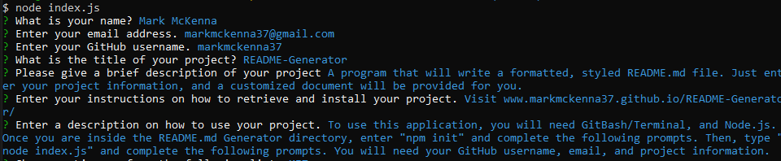
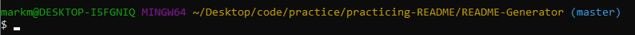
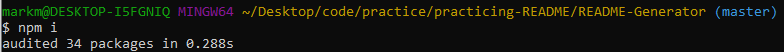
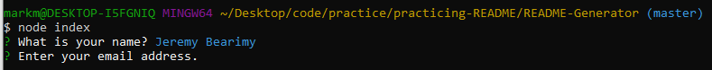

# README-Generator

## Testing
  

  
---
  
## Description 
A program that will write a formatted, styled README.md file. Just enter your project information, and a customized document will be provided for you.
[GitHub link](https://github.com/markmckenna37/README-Generator)
[Live GitHub link](https://markmckenna37.github.io/README-Generator/)
                      
--- 
                      
## Table of Contents
                      
                      
* [Installation](#installation)
* [Usage](#usage)
* [Contributing](#contributing)
* [License](#license)
* [Questions](#questions)
                      
---
                      
## Installation
                      
Visit the GitHub [Repository](www.markmckenna37.github.io/README-Generator/) and clone the repo to a local directory on your computer.
                      
                      
---
                      
## Usage 
                      
To use this application, you will need GitBash/Terminal, and Node.js. Change into the README.md Generator directory

Once you are inside the README.md Generator directory, enter "npm i"

Then, type "node index.js" and complete the following prompts. You will need your GitHub username, email, and project information.

                      
---
                      
## Contributing
                      
Mark McKenna
                      
---
                      
## License
                      
This project is licensed under MIT.
  
Copyright (c) [2020] [Mark McKenna]
  
                      
---
                                                         
## Questions
Have any questions or contributions? Check out my [GitHub Profile](https://github.com/markmckenna37)                 
Or you can email me at <markmckenna37@gmail.com>.
                      
---
                      
## Tests
                      

